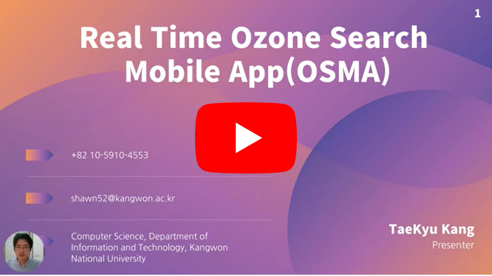

# Description of REAL TIME Ozone_Search_Mobile_App(OSMA)📱
"Ozone_Search_Mobile_App(OSMA)📱" is a mobile application that incorporates visualization dashboard and represents real-time ozone figures. OSMA is developed with Java and real-time ozone public API.

* Explanation Video KR @ https://youtu.be/g4UX_BQAUv8
* Explanation Video ENG @ https://youtu.be/dWM8u7iAA-A
* Download Presentation PDF @ https://drive.google.com/file/d/1gww_53U3npBvnvLgzyVbujpZyI1239zy/view?usp=sharing

👇(Watch Video) Click!👇

## What is Ozone?
Ozone (/ˈoʊzoʊn/), or trioxygen, is an inorganic molecule with the chemical formula O
3. It is a pale blue gas with a distinctively pungent smell. It is an allotrope of oxygen that is much less stable than the diatomic allotrope O
2, breaking down in the lower atmosphere to O
2 (dioxygen). Ozone is formed from dioxygen by the action of ultraviolet (UV) light and electrical discharges within the Earth's atmosphere. It is present in very low concentrations throughout the latter, with its highest concentration high in the ozone layer of the stratosphere, which absorbs most of the Sun's ultraviolet (UV) radiation(referenced by wikipedia).

## Why OSMA?
Ozone contamination increases mortality, cerebral infarction, and skin cancer. Waste gas, water contamination, and environmental pollution have stimulated the relatively low amount of ozone. As we couldn't stand and watch, we suggest measuring precise ozone figures to prevent its fundamental problems.

## OSMA Dependencies 
OSMA was built in android studio and with Java, interior database.

## OSMA Implementation
Import our repository and make OSMA apk file to your android studio.

## References
Public dataset API: https://www.data.go.kr/

## Authors
**Shawn Kang**,  *Initial work*,  *email : taegue52@daum.net*
